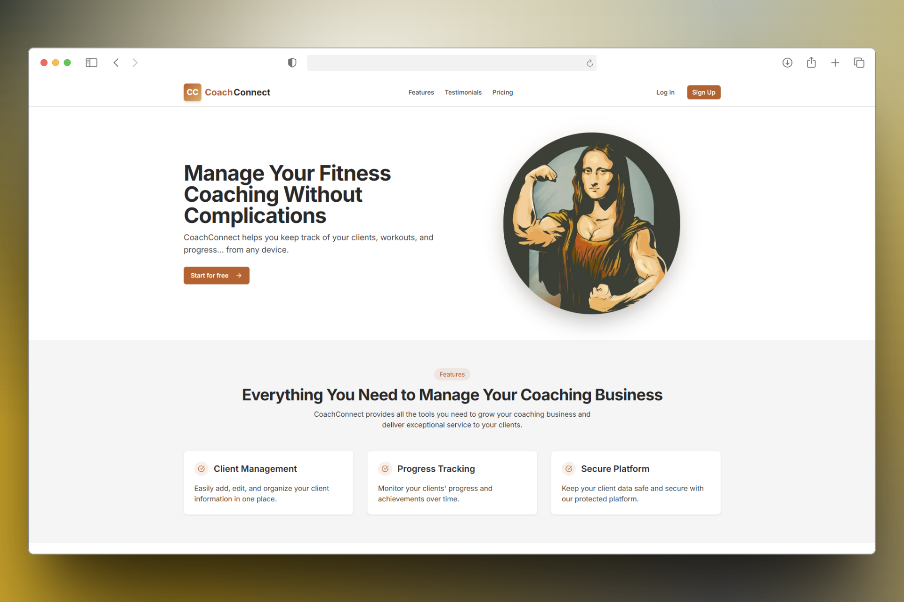

# CoachConnect

## Frontend

**URL de la aplicación:** [https://coach-connect-frontend.vercel.app](https://coach-connect-frontend.vercel.app)

CoachConnect es una plataforma web moderna desarrollada con Next.js, React y Tailwind CSS, diseñada para que coaches de fitness gestionen clientes, perfiles y progreso de manera eficiente y segura.

### Características principales

- **Gestión de clientes:** Agrega, edita y organiza la información de tus clientes en un solo lugar.
- **Seguimiento de progreso:** Visualiza el avance y logros de cada cliente a lo largo del tiempo.
- **Perfil de coach:** Personaliza tu perfil, foto, biografía y datos de contacto.
- **Autenticación segura:** Registro, login y recuperación de contraseña con validación de email.
- **Panel de control:** Navegación intuitiva para acceder a clientes, perfil y configuraciones.
- **Diseño responsivo:** Interfaz atractiva y adaptable a cualquier dispositivo.

### Estructura del frontend

- **/src/app/**: Páginas principales, rutas protegidas y layout global.
- **/src/auth/**: Componentes de autenticación (login, registro, recuperación de contraseña).
- **/src/clients/**: Componentes y helpers para gestión de clientes.
- **/src/components/**: Navegación, UI y utilidades compartidas.
- **/src/landing/**: Secciones de la landing page (Hero, Features, Testimonials, Pricing, Footer).
- **/src/config/**: Configuración de Axios para llamadas a la API.
- **/public/**: Recursos estáticos e imágenes.

---

## Backend

CoachConnect Backend es una API REST construida con NestJS y MongoDB, que provee autenticación, gestión de coaches y clientes, y lógica de negocio segura para la plataforma.

### Características principales

- **Autenticación JWT:** Registro, login, confirmación de email y recuperación de contraseña para coaches.
- **Gestión de coaches:** Actualización de perfil, cambio de contraseña y obtención de datos personales.
- **Gestión de clientes:** CRUD completo de clientes asociados a cada coach.
- **Validaciones robustas:** Uso de DTOs y validadores para asegurar integridad de datos.
- **Protección de rutas:** Guardas personalizados para rutas privadas.
- **Envío de emails:** Confirmación de cuenta y recuperación de contraseña vía correo electrónico.
- **Documentación Swagger:** API documentada y testeable visualmente.

### Estructura del backend

- **/src/auth/**: Módulo de autenticación, controladores, servicios, DTOs, entidades y guards.
- **/src/coach/**: Módulo de coaches, controladores y servicios para perfil y seguridad.
- **/src/clients/**: Módulo de clientes, controladores y servicios para CRUD.
- **/test/**: Pruebas e2e.

---

> Para más detalles, consulta los README de cada subproyecto.
